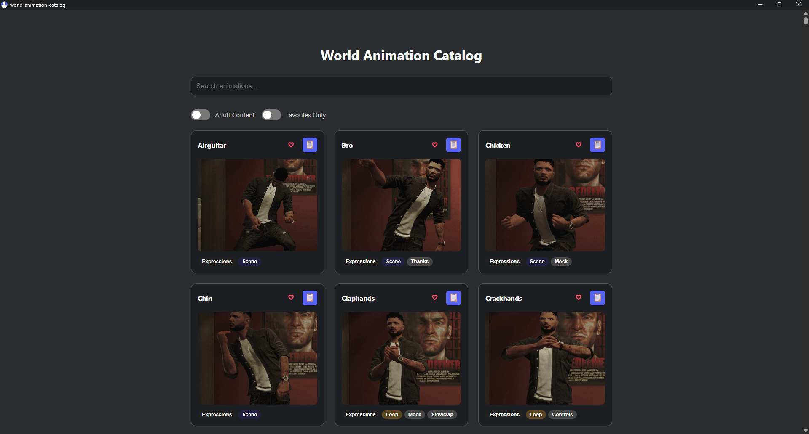

---

# 🌍 World Animation Catalog

A quick, searchable index of in-game and custom animations for GTA: World, designed to increase immersion and enhance the roleplay experience. For both veteran players and newcomers alike, this application allows you to efficiently browse, preview, and choose animations submitted by the wider GTA and GTA:W community.

As a player, I frequently wished I had precisely the right animation at the moment — but if it wasn't all choreographed ahead of time, I'd miss the window. The animation system in the game serves favorites and basics well, but if you haven't spent hours upon hours testing, scrolling, failing, and sitting through awkward mid-scene pauses, you've likely had the same thought I did:
"Wish I knew what that animation was like, I would've applied it here."

This app solves that. It provides a seamless, native-like desktop experience with persistent favorites, intelligent search system and live data drawn from a GitHub-hosted animation catalog. It's light, it's quick, and it's designed for roleplayers who like to get the little things perfect.

---

## ✨ Features

- 🔍 **Searchable animation catalog** with tag support and filtering.
- ❤️ **Favorites system** (stored locally - separate from the in-game system).
- 🧩 **Tag autocomplete** for fast and intuitive searching (type `tag:`).
- 🔞 **Adult content toggle** for filtering sensitive content.
- 📋 Click-to-copy animation commands.
- 📦 Ready to add more upon receiving community requests.

---

## 🚀 Installation

- Head to the [releases](https://github.com/Vierdant/world-animation-catalog/releases) page.
- Download the latest installer.
- Run it.

Note: The installer might give you a warning that it's from an untrusted source, however, that's only because I didn't bother buying a Microsoft certificat. It's open source. It's safe.

---

## 🧩 Animation Data

All animation metadata is fetched from a GitHub JSON file hosted in this repo. It is NOT linked to the game, so if anything changes, I, or someone has to update it manually.

---

## 🧪 Dev Notes

- Uses reactive Svelte stores and the DOM for dynamic behavior.
- Favorites are persisted using Tauri’s filesystem-safe local store.
- Fuzzy search functions.

---

## 🤝 Contributing

Pull requests are welcome! Feel free to open an issue to discuss bugs or suggestions.

### Prerequisites
- [Rust](https://www.rust-lang.org/tools/install)
- [Node.js](https://nodejs.org/) (v16+ recommended)
- [Tauri CLI](https://tauri.app/v1/guides/getting-started/prerequisites)

### Clone & Run

```bash
git clone https://github.com/Vierdant/world-animation-catalog.git
cd world-animation-catalog
npm install
npm run tauri dev
```

---

## 📄 License

MIT © [Vierdant](https://github.com/Vierdant)

---

## 🙋‍♂️ Acknowledgements

- Inspired by the creativity of the GTA:W roleplay community
- Poster images used in the app are for visual context only.
- I, Vierdant, am by no means affiliated with Rockstar, GTA related projects or GTA:W development teams. This is an applicated made in my spare time.

---

## 🛠 Tech Stack

- **[Tauri](https://tauri.app/)** — native app runtime
- **[Svelte](https://svelte.dev/)** — frontend framework
- **[@tauri-apps/plugin-store](https://docs.rs/tauri-plugin-store/)** — for persistent storage
- **Fuse.js** — for fuzzy searching
- **GitHub-hosted JSON** — as remote animation database
